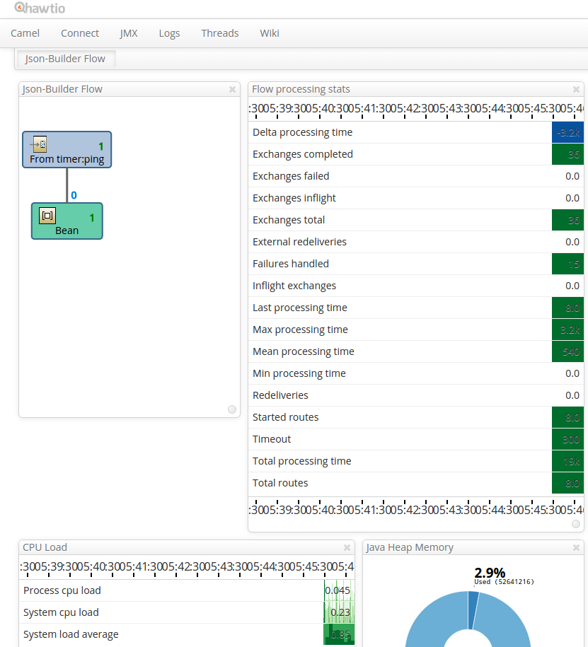

# MixedEmotions ETL Pipeline

# Building
`mvn clean package shade:shade`

# Running
`java -jar target/etl-pipeline-1-jar-with-dependencies.jar -c conf/application.conf`


# Hawt.io
Hawt.io is a web application that provides monitoring of for example Apache Camel-based applications.

After the pipeline starts up, you can view a preconfigured dashboard at [http://localhost:8080/hawtio/dashboard/id/512cefc2bdb5015495](http://localhost:8080/hawtio/dashboard/id/512cefc2bdb5015495)



## Development
To easily run Hawt.io during development, you have to initialize the hawtio_conf/ directory download the hawtio war first.

Initialize hawtio_conf/ (from the root of the repo):

```bash
cd hawtio_conf/
git init && git add dashboards/ && git commit -a -m "Initial commit"
```

Download hawtio war (from the root of the repo):

```bash
mkdir lib
cd lib
wget https://oss.sonatype.org/content/repositories/public/io/hawt/hawtio-default/1.4.52/hawtio-default-1.4.52.war
```
