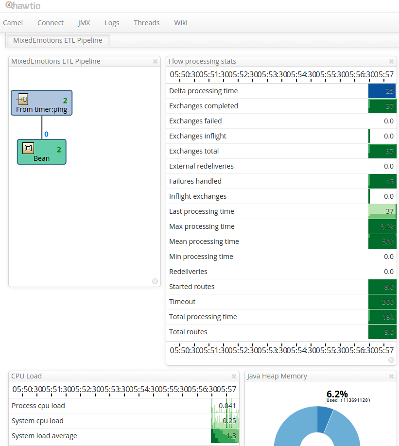

# MixedEmotions ETL Pipeline

The MixedEmotions ETL Pipeline extracts data from the Deutsche Welle (private) API, enriches it with information
about detected entities, sentiment, etc., and loads the enriched records into Elasticsearch.

It is an [Apache Camel](http://camel.apache.org/)-based application.

# Building
`mvn clean package shade:shade`

# Running
`java -jar target/etl-pipeline-1-jar-with-dependencies.jar -c conf/application.conf`

# Development
The pipeline is defined in the [DwRoute class](src/main/java/com/sindicetech/mixedemotions/etl/DwRoute.java).

To add a new component, simply add a snippet such as:

```Java
    // The video transcription route
    // Perform video transcription and send to the TopicExtraction endpoint
    from("seda:VideoTranscription?concurrentConsumers=4")
        .to("log:VideoTranscriptionProcessor?showHeaders=true")
        .process(new VideoTranscriptionProcessor())
        .to("direct:TopicExtraction");
```

and implement the [VideoTranscriptionProcessor class](src/main/java/com/sindicetech/mixedemotions/etl/processor/VideoTranscriptionProcessor.java). 

# Hawt.io
Hawt.io is a web application that provides monitoring of for example Apache Camel-based applications.

After the pipeline starts up, you can view a preconfigured dashboard at [http://localhost:8080/hawtio/dashboard/id/512cefc2bdb5015495](http://localhost:8080/hawtio/dashboard/id/512cefc2bdb5015495)



## Development
To easily run Hawt.io during development, you have to initialize the hawtio_conf/ directory download the hawtio war first.

Initialize hawtio_conf/ (from the root of the repo):

```bash
cd hawtio_conf/
git init && git add dashboards/ && git commit -a -m "Initial commit"
```

Download hawtio war (from the root of the repo):

```bash
mkdir lib
cd lib
wget https://oss.sonatype.org/content/repositories/public/io/hawt/hawtio-default/1.4.52/hawtio-default-1.4.52.war
```
